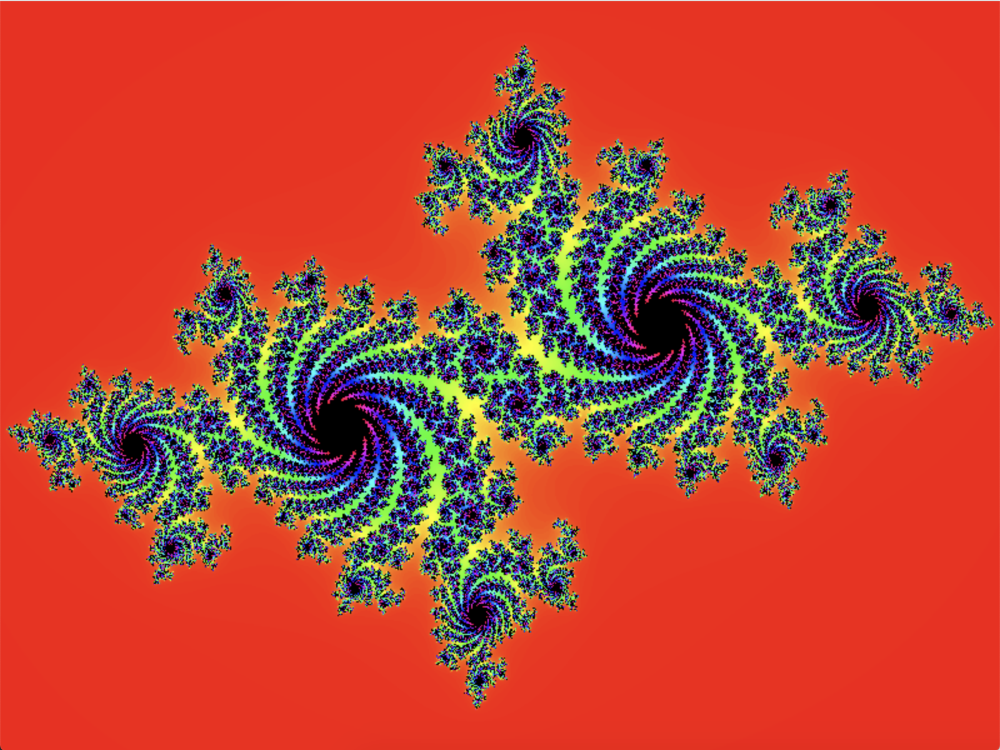
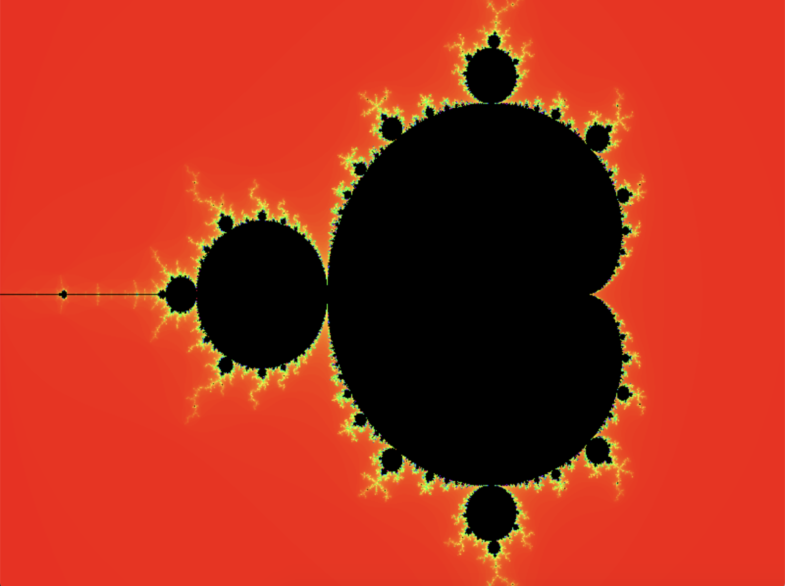
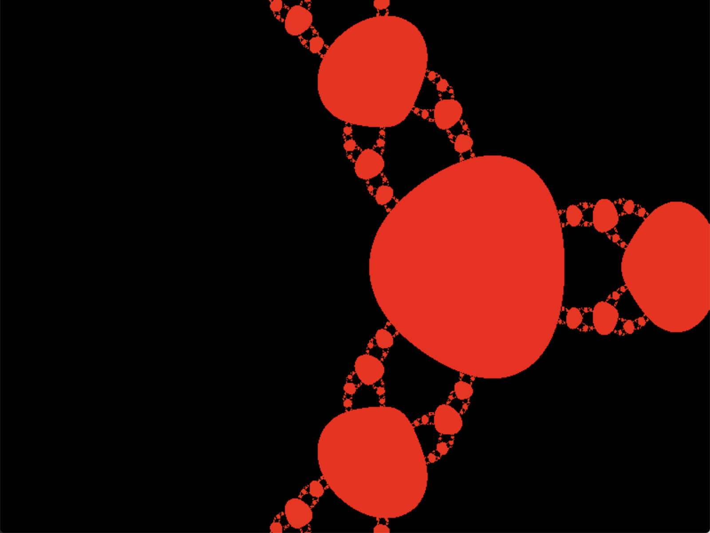

# Fract-ol

### First contact with a C graphic library, concrete mlx.h library. In this project you must create some fractol paints, mandatory is Julia and Mandelbrot. Bonus is to create another fractol image and give some habilities to the paint, like color changing, etc... For more info about requierements of this project you can check this subjects versions in [english](Subject/en.subject.pdf) or [spanish](Subject/es.subject.pdf).

### If you want to check this program you must compile with "make", after that you will have an executable file named "fractol". To run this executable you must launch it with the fractol name that you desire "Julia", "Mandelbrot" or "Newton". A new window appear with the paint desired. Before use any key be sure that you have enable the paint window by clicking on it.

### You can move the image with the arrows keys or zoom in any part of the paint with the mouse wheel, any move of the mouse shows you the concrete zoom that you are using in each moment. Take care cause each zoom will decrease the response of any action, that is because the computer must make thousands of opeations to calculate each pixel. To change colour you can use the "c" key or reset the new colours with "r" key. To finish the program you can push "ESC" or use the window close botton. You can show a spanish menu with all the options on the top right of the screen if you keep pressed "h" key.

### "make && ./fractol Julia" will show you:

### "make && ./fractol Mandelbrot" will show you:

### "make && ./fractol Newton" will show you:

### Graded: 

